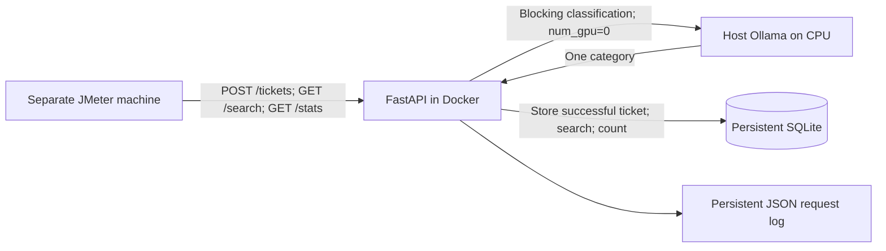

# Twelve-slide evidence preparation

Status: **BENCHMARK ANALYSIS COMPLETE; PRESENTATION/MEMBER DETAILS PENDING**.
No PowerPoint was created or edited. This table points to verified evidence;
remaining human and runtime details are explicit. Requirements/predictions
were frozen at `2db5306d41a5b8dee9812cec005c4145dfd734fe`.

| Slide | Information prepared | Evidence and remaining work |
|---|---|---|
| 1. Cover | Group 7; Ticket Triage Service; [repository](https://github.com/MoeMaki33/ICT3113_Assignment_1) | TODO: member names, student IDs and confirmation of submission title |
| 2. Architecture | Separate load generator -> FastAPI -> blocking CPU Ollama -> SQLite -> response; POST /tickets, GET /search, GET /stats; no application cache/queue/batching | Source: `app/`, `Dockerfile`, `docker-compose.yml`; diagram below |
| 3. Workload | Frozen design peak 250 tickets/h; searches 450/h; weekday daytime about 89/h, night about 22/h; 1,000 team narratives, character p50 755 and p95 1,791 | `workload_model.md`, `results/workload/`; source links in `references.md`; these are workload estimates/dataset statistics, not service measurements |
| 4. Requirements | Frozen R1 mean POST p95 <=15 s and p99 <=30 s; R2 each run >=245 successful/h, errors <1%; R3 >=80% overall and >=70% each category; R4 mean search p95 <=1 s | [requirements.md](requirements.md); rules unchanged |
| 5. Models | Four exact tags, small 2-4B / medium 7-9B, historical full digests and licences | `models.md`, `app/candidate_models.py`, `results/model_provenance.json`; TODO: recheck on actual test machine |
| 6. Golden set | 180 deterministic tickets from rows 7000-7999; two sheets; 153 agreements, 27 disagreements, 85% raw agreement, kappa 0.8239066633; all resolutions present; protocol v1.1 adds prepaid-card guidance | `labelling_protocol.md`, annotation/resolution CSVs, `agreement.json`; examples below; Historical source-hash discrepancy reviewed in golden_set_provenance.md; original bytes/cause unknown; real annotator identities/approval remain human evidence |
| 7. Environment | Official PC1 i7-10510U, 4 cores/8 logical processors, 15.8 GB; separate PC2 Ryzen 5800X3D, 8/16, 31.93 GB, JMeter 5.6.3 | [test_environment.md](test_environment.md); runtime CPU%, memory, processor split, Docker limits and fresh PC1 digests unavailable |
| 8. Procedure | Four full 180-ticket accuracy runs; 36 load runs at 125, 250+450 searches, 500/h; two Qwen stress steps | Metadata under results; ten-minute measured windows after two-minute warm-up; no new runs in analysis |
| 9. Load and stress | Mixed POST mean p95: 18.351 / 12.800 / 77.689 / 97.311 s; mean achieved 254 / 256 / 236 / 228 per hour (Gemma / Llama 3.2 / Qwen / Llama 3.1) | [recommendation.md](recommendation.md) gives individual-run R2 failures; [bottleneck_analysis.md](bottleneck_analysis.md) qualifies 75/h trend; no sustainable maximum established |
| 10. Accuracy | Correct/180: 121 / 109 / 145 / 152; Qwen alone passes all R3 floors | [prediction_vs_results.md](prediction_vs_results.md), metrics and confusion matrices; Gemma run-2, others run-1 |
| 11. Predictions and recommendation | All latency predictions optimistic; Debt collection weakest only for Llama 3.1; no fully compliant candidate; Qwen for future evaluation | [prediction_vs_results.md](prediction_vs_results.md), [recommendation.md](recommendation.md); R1 only Llama 3.2 passes, R2 all fail, R3 only Qwen passes, R4 all pass |
| 12. References | Primary CFPB/FCA/Ollama/JMeter/model/licence links assembled | `references.md`; TODO: exact course release, model licence captures, actual software releases and acknowledgements |

Architecture describes application behaviour. Concurrent HTTP requests can wait
inside Ollama; this does not introduce an application classification queue.

Adjudication examples: inspect disagreement rows **7382** and **7882**, their
final human labels and resolution notes. These motivated the prepaid/gift-card
rule in protocol v1.1. Quote a short, redacted summary from the human notes for
the presentation; do not reproduce a full complaint or replace the stored label.
