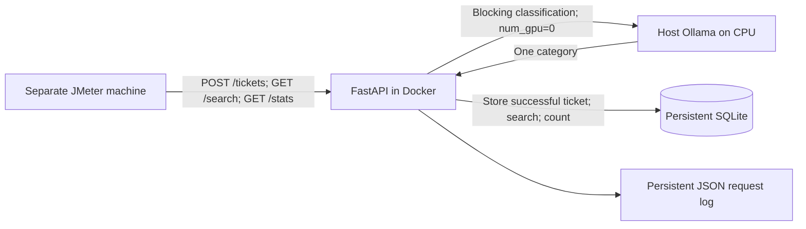

# Twelve-slide evidence preparation

Status: **PARTIAL; FORMAL RESULTS PENDING**. No PowerPoint was created or edited.
TODOs below require real evidence or team input. Draft requirements/predictions
must be approved before appearing as frozen commitments.

| Slide | Information prepared | Evidence and remaining work |
|---|---|---|
| 1. Cover | Group 7; Ticket Triage Service; [repository](https://github.com/MoeMaki33/ICT3113_Assignment_1) | TODO: member names, student IDs and confirmation of submission title |
| 2. Architecture | Separate load generator -> FastAPI -> blocking CPU Ollama -> SQLite -> response; POST /tickets, GET /search, GET /stats; no application cache/queue/batching | Source: `app/`, `Dockerfile`, `docker-compose.yml`; diagram below |
| 3. Workload | Proposed design peak 250 tickets/h; searches 450/h; weekday daytime about 89/h, night about 22/h; 1,000 team narratives, character p50 755 and p95 1,791 | `workload_model.md`, `results/workload/`; source links in `references.md`; these are workload estimates/dataset statistics, not service measurements |
| 4. Requirements | Proposed POST p95 <=15 s and p99 <=30 s; >=245 successful/h, errors <1%; accuracy >=80% overall, >=70% every category; mixed-load search p95 <=1 s | `requirements.md`; TODO: team approval and the pre-freeze interpretation questions in `completion_audit.md` |
| 5. Models | Four exact tags, small 2-4B / medium 7-9B, historical full digests and licences | `models.md`, `app/candidate_models.py`, `results/model_provenance.json`; TODO: recheck on actual test machine |
| 6. Golden set | 180 deterministic tickets from rows 7000-7999; two sheets; 153 agreements, 27 disagreements, 85% raw agreement, kappa 0.8239066633; all resolutions present; protocol v1.1 adds prepaid-card guidance | `labelling_protocol.md`, annotation/resolution CSVs, `agreement.json`; examples below; TODO: resolve source-hash provenance and record real annotator identities/approval |
| 7. Environment | Official PC1: Intel i7-10510U @ 1.80 GHz, 4 physical cores / 8 logical processors, 15.8 GB RAM, Windows 11 Home 64-bit, OS 10.0.26200; Docker CLI 29.4.3, Compose v5.1.3, project host Python 3.12.14; intended CPU-only Ollama + Docker service. PC2: separate physical desktop | `test_environment.md`; PC2 specifications/versions and network TO BE RECORDED; PC1 Ollama/container versions, power/WSL limits and runtime CPU captures TO BE RECORDED. Historical i7-10750H model provenance and JMeter testing on PC1 do not establish PC2 or PC1 model readiness |
| 8. Procedure | All golden tickets through POST for every candidate; open-loop JMeter at 125, 250+450 searches and 500 tickets/h; three runs/configuration; stepped stress test with fixed stopping criteria | `test_playbook.md`, JMX, runners; TODO: record actual execution dates/commands |
| 9. Load and stress | Raw `.jtl`, p50/p95/p99, achieved throughput, errors, mean/SD/min/max and reconciliation tooling prepared | TODO: every measured value, three-run spread, measured stress bracket and bottleneck; `results/load/`, `results/stress/`, `bottleneck_analysis.md` |
| 10. Accuracy | Overall/per-category recall and confusion matrix output prepared; failures count incorrect | TODO: all four full model runs and raw predictions; `results/accuracy/<model>/run-N/` |
| 11. Predictions and recommendation | Original draft prediction record preserved; separate comparison and requirement decision tables prepared | TODO: frozen predictions, observed outcomes, incorrect-prediction explanations, PASS/FAIL and defensible recommendation; `prediction_vs_results.md`, `recommendation.md` |
| 12. References | Primary CFPB/FCA/Ollama/JMeter/model/licence links assembled | `references.md`; TODO: exact course release, model licence captures, actual software releases and acknowledgements |

Architecture describes application behaviour. Concurrent HTTP requests can wait
inside Ollama; this does not introduce an application classification queue.

Adjudication examples: inspect disagreement rows **7382** and **7882**, their
final human labels and resolution notes. These motivated the prepaid/gift-card
rule in protocol v1.1. Quote a short, redacted summary from the human notes for
the presentation; do not reproduce a full complaint or replace the stored label.
